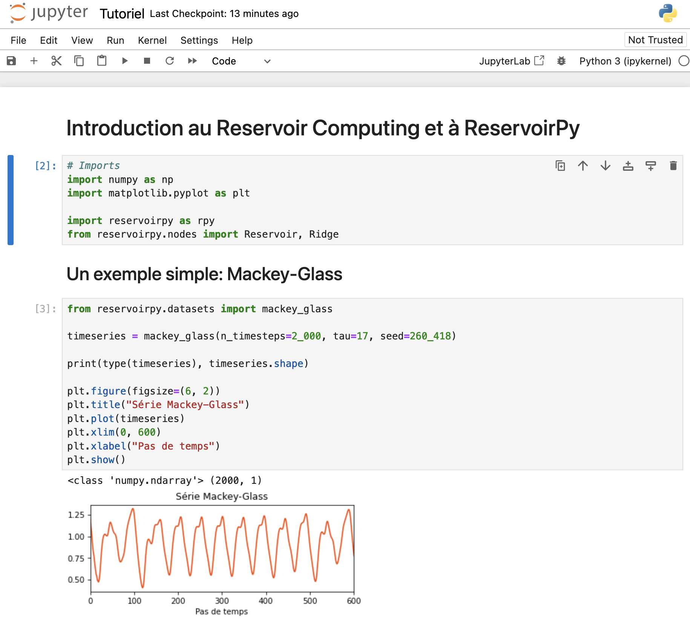

# PFIA 2024 - Tutoriel Reservoir Computing & ReservoirPy (La Rochelle, juillet 2024)




## Installation

### En local

1. Clonez le dépôt
    - Dans le terminal: `git clone git@github.com:reservoirpy/PFIA2024.git`
    - Ou directement sur GitHub: Code -> Download ZIP

2. Installez les dépendances du tutoriel

    Dans le dossier: `pip install -r requirements.txt`

### Sur Google Colab

Fichier -> Ouvrir le notebook -> GitHub -> `reservoirpy/PFIA2024` -> Tutorial

Vous devrez également télécharger les données directement depuis le code Python.

##### Pour le dataset RTE (prédiction)

```python
dataset = pd.read_csv("https://raw.githubusercontent.com/reservoirpy/PFIA2024/master/datasets/conso_electricite_rte.csv")
```

##### Pour le dataset FordA (classification)
```python
!pip install requests
import pickle
import requests
from io import BytesIO

response = requests.get('https://raw.githubusercontent.com/reservoirpy/PFIA2024/master/datasets/FordA.p')

fordA = pickle.load(BytesIO(response.content))
```
